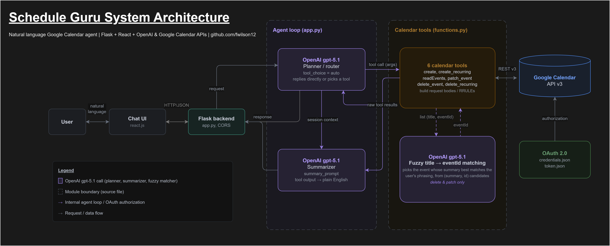

# Schedule Guru


An AI chat interface that lets you manage your Google Calendar in plain English.

Ask it to schedule a meeting, move an appointment, set up a recurring event, or clear your afternoon. Schedule Guru transforms your requests into Google Calendar API calls and reports back conversationally.

## Demo

[](https://www.youtube.com/watch?v=qWKtCeK2vFg)

## Features

- **Dynamic natural-language scheduling**: create, read, update, and delete events through conversation that are custom-fit to your schedule
- **Recurring events via RRULEs** (`create_recurring`, `delete_recurring`): "every Monday", "first Tuesday each month", "MWF until June"
- **Fuzzy event matching**: refer to events by description ("move my dentist appointment") instead of IDs
- **Conflict awareness**: checks your existing schedule before booking and suggests alternatives when times clash
- **Conversational summaries**: plain-English recaps of what changed, not raw API responses

**Calendar tools:** `create` · `create_recurring` · `readEvents` · `patch_event` · `delete_event` · `delete_recurring`

## Usage

Once both servers are running (see [Getting started](#-getting-started)), open the frontend and just talk to it. Some examples:

| You say                                                                                      | What it does                                                                                |
| -------------------------------------------------------------------------------------------- | ------------------------------------------------------------------------------------------- |
| "Schedule a meeting with the jedi council next Tuesday at 2pm"                               | Creates a one-time event                                                                    |
| "What's on my calendar this week?"                                                           | Reads and summarizes upcoming events                                                        |
| "Move my meeting to Thursday morning"                                                        | Finds the event, then updates its time                                                      |
| "Put my linear algebra lecture on my calendar: M/W from 9 to 10:30 am through December 10th" | Creates a recurring event with an `RRULE`                                                   |
| "Cancel my Tai-Chi sessions. They're getting too intense for me."                            | Finds and deletes the recurring event, offers emotional support                             |
| "I need to block out 7-8 hours to study for finals next week, what times work best?"         | Reads your schedule, suggests strategies to split up the studying when you're free each day |

Schedule Guru is always knows what time it is, and always confirms a requested time doesn't conflict with existing events, proposing alternatives when it does.

## Architecture

<p align="center">
  
</p>

A React frontend talks to a Flask backend that runs an OpenAI `gpt-5.1` agent loop. The model acts as a planner: it either replies directly if it has the information to resolve the user's request, or dynamically selects one of six calendar tools. Tool results are fed through a second `gpt-5.1` summarizer pass that turns raw API output into plain English (and can chain further tool calls). For the `delete` and `patch` flows, a small `gpt-5.1` helper performs fuzzy title → `eventId` matching, resolving a spoken event name against the actual events on your calendar. All calendar operations go through the Google Calendar API v3, authorized via OAuth 2.0.

## Tech stack

| Layer    | Stack                                               |
| -------- | --------------------------------------------------- |
| Frontend | React 19, Vite                                      |
| Backend  | Python, Flask, Flask-CORS                           |
| LLM      | OpenAI `gpt-5.1` (function calling)                 |
| Calendar | Google Calendar API v3 (`google-api-python-client`) |
| Auth     | OAuth 2.0 (`google-auth-oauthlib`)                  |

## Project structure

```text
Schedule-Guru/
├── backend/
│   ├── app.py          # Flask API server; POST /chat, web-facing agent loop
│   ├── main.py         # CLI agent loop + tool_call() dispatcher
│   ├── functions.py    # Google Calendar tools (create, read, patch, delete)
│   └── vars.py         # System prompts, message history, OpenAI tool/function specs
├── frontend/
│   └── src/            # React 19 + Vite chat UI
├── assets/             # Architecture diagram and other images
├── requirements.txt    # Backend Python dependencies
├── credentials.json    # Google OAuth client: you provide (git-ignored)
└── token.json          # OAuth access/refresh token: auto-generated (git-ignored)
```

## Getting started

### Prerequisites

- Python 3.11+
- Node.js 18+
- An OpenAI API key
- A Google Cloud project with the Google Calendar API enabled and an OAuth 2.0 Desktop client

### Backend

From the project root, install the Python dependencies:

```bash
pip install -r requirements.txt
```

Create `backend/.env` with your OpenAI key:

```env
OPENAI_API_KEY=your_key_here
```

Download your OAuth client file from the Google Cloud Console, rename it to `credentials.json`, and place it in the project root. On first run you'll be prompted to authorize calendar access in the browser, and a `token.json` will be created automatically.

> **Note:** keep `credentials.json` and `token.json` out of version control — they hold your OAuth client secret and a live access token. Both are already listed in `.gitignore`.

Run the server:

```bash
cd backend
python app.py        # http://localhost:5000  (POST /chat)
```

### Frontend

```bash
cd frontend
npm install
npm run dev          # http://localhost:5173
```

## License

Released under the [MIT License](LICENSE). © 2026 Fletcher Wilson.
